cultural_a3
================
Laura Lundbye
2024-11-19

``` r
library(tidyverse)
```

    ## ── Attaching core tidyverse packages ──────────────────────── tidyverse 2.0.0 ──
    ## ✔ dplyr     1.1.4     ✔ readr     2.1.5
    ## ✔ forcats   1.0.0     ✔ stringr   1.5.1
    ## ✔ ggplot2   3.5.1     ✔ tibble    3.2.1
    ## ✔ lubridate 1.9.3     ✔ tidyr     1.3.1
    ## ✔ purrr     1.0.2     
    ## ── Conflicts ────────────────────────────────────────── tidyverse_conflicts() ──
    ## ✖ dplyr::filter() masks stats::filter()
    ## ✖ dplyr::lag()    masks stats::lag()
    ## ℹ Use the conflicted package (<http://conflicted.r-lib.org/>) to force all conflicts to become errors

``` r
library(dplyr)
library(ggthemes)
library(brms)
```

    ## Loading required package: Rcpp
    ## Loading 'brms' package (version 2.21.0). Useful instructions
    ## can be found by typing help('brms'). A more detailed introduction
    ## to the package is available through vignette('brms_overview').
    ## 
    ## Attaching package: 'brms'
    ## 
    ## The following object is masked from 'package:stats':
    ## 
    ##     ar

``` r
#loading data 
tags_df <- read.csv("/Users/laura/Desktop/uni/cultural_intro/banned_books_tags.csv")
str(tags_df)
```

    ## 'data.frame':    364 obs. of  8 variables:
    ##  $ Title         : chr  "Scary Stories (series)" "Daddy\xd5s Roommate" "I Know Why the Caged Bird Sings" "The Chocolate War" ...
    ##  $ Author        : chr  "Alvin Schwartz" "Michael Willhoite" "Maya Angelou" "Robert Cormier" ...
    ##  $ Year          : int  1990 1990 1990 1990 1990 1990 1990 1990 1990 1990 ...
    ##  $ Goodreads_tags: chr  "Horror, Paranormal, Short Stories, Fiction, Ghosts, Supernatural, Fantasy" "Picture, Books, LGBT, Childrens Fiction, Family, Queer" "Nonfiction, Classics, Memoir, Biography, Autobiography, Poetry, Feminism" "Young Adult, Fiction, Classics, Realistic Fiction, School, Teen" ...
    ##  $ X             : logi  NA NA NA NA NA NA ...
    ##  $ X.1           : logi  NA NA NA NA NA NA ...
    ##  $ X.2           : logi  NA NA NA NA NA NA ...
    ##  $ X.3           : logi  NA NA NA NA NA NA ...

``` r
# preprocessing
# selecting and cleaning relevant columns
tags_df <- tags_df %>%
select(Title, Author, Year, Goodreads_tags)

# separating tags for grouping
tags_df <- tags_df %>%
separate_rows(Goodreads_tags, sep = ", ") %>%
mutate(Goodreads_tags = trimws(Goodreads_tags))
```

``` r
# grouping goodreads tags into thematic groups
tag_groups <- list(
"LGBTQ" = c("LGBT", "Queer", "Transgender", "Sexuality", "Nontraditional Relationships"),
"Sexual content" = c("Sex", "Sex Education", "Erotica",
"Coming of Age", "Romance"),
"Fear and Speculation" = c("Horror", "Paranormal", "Supernatural",
"Dystopia", "Science Fiction"),
"African American themes" = c("Colonialism", "Decolonization", "African American","Social Justice", "Slavery"),
"Mental Health" = c("Mental Health", "Alcohol", "Drugs", "Addiction",
"Depression", "Anxiety", "Therapy", "Trauma",
"Abuse", "Recovery", "Health", "Well-Being"),
"Conflict and War" = c("War", "Conflict", "Revolution", "Holocaust", "Violence",
"World War II", "Vietnam War", "Iraq", "Afghanistan",
"American Revolution", "Political", "Resistance",
"Nationalism", "Imperialism", "Terrorism", "Holocaust", "Civil Rights Movement"),
"History and Cultural Perspectives" = c("Historical Fiction", "History", "Memoir",
"Biography", "Autobiography", "American History")
)

# assigning each tag to a thematic group
df_with_groups <- tags_df %>%
mutate(
Thematic_Group = case_when(
Goodreads_tags %in% tag_groups[["LGBTQ"]] ~ "LGBTQ",
Goodreads_tags %in% tag_groups[["African American themes"]] ~ "African American themes",
Goodreads_tags %in% tag_groups[["Sexual content"]] ~ "Sexual content",
Goodreads_tags %in% tag_groups[["Fear and Speculation"]] ~ "Fear and Speculation",
#Goodreads_tags %in% tag_groups[["Representation in Literature"]] ~ "Representation in Literature",
Goodreads_tags %in% tag_groups[["Mental Health"]] ~ "Mental Health",
Goodreads_tags %in% tag_groups[["Conflict and War"]] ~ "Conflict and War",
Goodreads_tags %in% tag_groups[["History and Cultural Perspectives"]] ~ "History and Cultural Perspectives",
TRUE ~ NA_character_
)
) %>%
filter(!is.na(Thematic_Group))

#keeping only one combination of thematic group and title
df_with_groups <- df_with_groups %>%
distinct(Title, Thematic_Group, .keep_all = TRUE)

#counting how many times each thematic group shows up for each decade
thematic_counts <- df_with_groups %>%
  group_by(Thematic_Group, Year) %>% 
  summarise(Count = n(), .groups = "drop")  
```

``` r
#plotting theme counts across categorical decades 
custom_colors <- c(
"LGBTQ" = "#1f78b4", # Blue
"Sexual content" = "#6a3d9a", # Purple
"Fear and Speculation" = "#33a02c", # Green
#"Representation in Literature" = "#b15928", # Brown (optional)
"Mental Health" = "#e31a1c", # Red (optional)
"Conflict and War" = "#ff7f00", # Orange (optional)
"History and Cultural Perspectives" = "#a6cee3", # Light Blue (optional)
"African American themes" = "#FAA49A"
)

ggplot(thematic_counts, aes(x = Year, y = Count, color = Thematic_Group)) +
geom_line(linewidth = 1.2) +
labs(
title = "Trends in Thematic Groups Over Years",
x = "Year",
y = "Number of Books",
color = "Thematic Group"
) +
scale_color_manual(values = custom_colors) + # Use custom colors
theme_stata() +
theme(
plot.title = element_text(hjust = 0.5, size = 16, face = "bold"),
legend.position = "bottom",
legend.title = element_text(size = 10),
legend.text = element_text(size = 6)
)
```

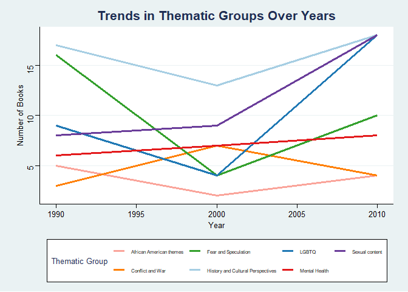<!-- -->

``` r
#further preprocessing data to make it ready for logistic regression
df_with_groups <- df_with_groups[, !names(df_with_groups) %in% c("Author", "Goodreads_tags")]

df_real <- df_with_groups %>%
  mutate(Value = 1) %>%  #adding a column to indicate presence with 1 or 0 for logistic regression
  pivot_wider(names_from = Thematic_Group, values_from = Value, values_fill = 0)

#renaming for model
colnames(df_real)[colnames(df_real) == "African American themes"] ="African_american_themes"
colnames(df_real)[colnames(df_real) == "Conflict and War"] ="Conflict_war"
colnames(df_real)[colnames(df_real) == "Fear and Speculation"] ="Fear_speculation"
colnames(df_real)[colnames(df_real) == "History and Cultural Perspectives"] ="Hist_cult"
colnames(df_real)[colnames(df_real) == "Mental Health"] ="Mental_health"
colnames(df_real)[colnames(df_real) == "Sexual content"] ="Sexual_content"
```

``` r
#making sure Year is categorical and not continuous
df_real$Year = as.factor(df_real$Year)

#we tried creating a multivariate model first, but due to little data it didnt converge
#here's the syntax anyway:

#model <-
#  bf(mvbind(Conflict_war, African_american_themes, Fear_speculation, Hist_cult, LGBTQ, Mental_health, Sexual_content) ~ Year)
#fit1 <- brm(model, data = df_real, family = bernoulli, chains = 2, cores = 2)
```

``` r
#creating seven simpler models instead with theme presence as logistic outcome, predicted by the independent variable year

# defining formulas
formula_conflict <- bf(Conflict_war ~ Year)
formula_african_american <- bf(African_american_themes ~ Year)
formula_fear <- bf(Fear_speculation ~ Year)
formula_hist <- bf(Hist_cult ~ Year)
formula_lgbtq <- bf(LGBTQ ~ Year)
formula_mental_health <- bf(Mental_health ~ Year)
formula_sexual_content <- bf(Sexual_content ~ Year)

# fitting each model
fit_conflict <- brm(formula = formula_conflict, data = df_real, family = bernoulli(), chains = 2, cores = 2)
```

    ## Compiling Stan program...

    ## Start sampling

``` r
fit_african_american <- brm(formula = formula_african_american, data = df_real, family = bernoulli(), chains = 2, cores = 2)
```

    ## Compiling Stan program...
    ## Start sampling

``` r
fit_fear <- brm(formula = formula_fear, data = df_real, family = bernoulli(), chains = 2, cores = 2)
```

    ## Compiling Stan program...
    ## Start sampling

``` r
fit_hist <- brm(formula = formula_hist, data = df_real, family = bernoulli(), chains = 2, cores = 2)
```

    ## Compiling Stan program...
    ## Start sampling

``` r
fit_lgbtq <- brm(formula = formula_lgbtq, data = df_real, family = bernoulli(), chains = 2, cores = 2)
```

    ## Compiling Stan program...
    ## Start sampling

``` r
fit_mental_health <- brm(formula = formula_mental_health, data = df_real, family = bernoulli(), chains = 2, cores = 2)
```

    ## Compiling Stan program...
    ## Start sampling

``` r
fit_sexual_content <- brm(formula = formula_sexual_content, data = df_real, family = bernoulli(), chains = 2, cores = 2)
```

    ## Compiling Stan program...
    ## Start sampling

``` r
# summarizing and plotting the models
summary(fit_conflict)
```

    ##  Family: bernoulli 
    ##   Links: mu = logit 
    ## Formula: Conflict_war ~ Year 
    ##    Data: df_real (Number of observations: 155) 
    ##   Draws: 2 chains, each with iter = 2000; warmup = 1000; thin = 1;
    ##          total post-warmup draws = 2000
    ## 
    ## Regression Coefficients:
    ##           Estimate Est.Error l-95% CI u-95% CI Rhat Bulk_ESS Tail_ESS
    ## Intercept    -2.96      0.63    -4.32    -1.88 1.00      904      809
    ## Year2000      1.54      0.76     0.16     3.12 1.00      935     1010
    ## Year2010      0.16      0.81    -1.40     1.82 1.00      967      990
    ## 
    ## Draws were sampled using sampling(NUTS). For each parameter, Bulk_ESS
    ## and Tail_ESS are effective sample size measures, and Rhat is the potential
    ## scale reduction factor on split chains (at convergence, Rhat = 1).

``` r
summary(fit_african_american)
```

    ##  Family: bernoulli 
    ##   Links: mu = logit 
    ## Formula: African_american_themes ~ Year 
    ##    Data: df_real (Number of observations: 155) 
    ##   Draws: 2 chains, each with iter = 2000; warmup = 1000; thin = 1;
    ##          total post-warmup draws = 2000
    ## 
    ## Regression Coefficients:
    ##           Estimate Est.Error l-95% CI u-95% CI Rhat Bulk_ESS Tail_ESS
    ## Intercept    -2.37      0.49    -3.43    -1.51 1.00     1504     1117
    ## Year2000     -0.64      0.96    -2.71     1.03 1.01     1215     1341
    ## Year2010     -0.45      0.77    -2.06     1.04 1.00     1218      999
    ## 
    ## Draws were sampled using sampling(NUTS). For each parameter, Bulk_ESS
    ## and Tail_ESS are effective sample size measures, and Rhat is the potential
    ## scale reduction factor on split chains (at convergence, Rhat = 1).

``` r
summary(fit_fear)
```

    ##  Family: bernoulli 
    ##   Links: mu = logit 
    ## Formula: Fear_speculation ~ Year 
    ##    Data: df_real (Number of observations: 155) 
    ##   Draws: 2 chains, each with iter = 2000; warmup = 1000; thin = 1;
    ##          total post-warmup draws = 2000
    ## 
    ## Regression Coefficients:
    ##           Estimate Est.Error l-95% CI u-95% CI Rhat Bulk_ESS Tail_ESS
    ## Intercept    -0.90      0.30    -1.50    -0.35 1.00     1877     1374
    ## Year2000     -1.25      0.66    -2.58    -0.03 1.00     1336     1187
    ## Year2010     -0.82      0.45    -1.70     0.07 1.00     1595     1333
    ## 
    ## Draws were sampled using sampling(NUTS). For each parameter, Bulk_ESS
    ## and Tail_ESS are effective sample size measures, and Rhat is the potential
    ## scale reduction factor on split chains (at convergence, Rhat = 1).

``` r
summary(fit_hist)
```

    ##  Family: bernoulli 
    ##   Links: mu = logit 
    ## Formula: Hist_cult ~ Year 
    ##    Data: df_real (Number of observations: 155) 
    ##   Draws: 2 chains, each with iter = 2000; warmup = 1000; thin = 1;
    ##          total post-warmup draws = 2000
    ## 
    ## Regression Coefficients:
    ##           Estimate Est.Error l-95% CI u-95% CI Rhat Bulk_ESS Tail_ESS
    ## Intercept    -0.82      0.29    -1.40    -0.27 1.00     1148     1340
    ## Year2000      0.29      0.46    -0.60     1.24 1.00     1251     1300
    ## Year2010     -0.15      0.42    -0.97     0.70 1.00     1437     1351
    ## 
    ## Draws were sampled using sampling(NUTS). For each parameter, Bulk_ESS
    ## and Tail_ESS are effective sample size measures, and Rhat is the potential
    ## scale reduction factor on split chains (at convergence, Rhat = 1).

``` r
summary(fit_lgbtq)
```

    ##  Family: bernoulli 
    ##   Links: mu = logit 
    ## Formula: LGBTQ ~ Year 
    ##    Data: df_real (Number of observations: 155) 
    ##   Draws: 2 chains, each with iter = 2000; warmup = 1000; thin = 1;
    ##          total post-warmup draws = 2000
    ## 
    ## Regression Coefficients:
    ##           Estimate Est.Error l-95% CI u-95% CI Rhat Bulk_ESS Tail_ESS
    ## Intercept    -1.67      0.37    -2.44    -0.99 1.00     1121      930
    ## Year2000     -0.45      0.67    -1.85     0.79 1.00     1196     1190
    ## Year2010      0.70      0.47    -0.18     1.68 1.00     1230     1038
    ## 
    ## Draws were sampled using sampling(NUTS). For each parameter, Bulk_ESS
    ## and Tail_ESS are effective sample size measures, and Rhat is the potential
    ## scale reduction factor on split chains (at convergence, Rhat = 1).

``` r
summary(fit_mental_health)
```

    ##  Family: bernoulli 
    ##   Links: mu = logit 
    ## Formula: Mental_health ~ Year 
    ##    Data: df_real (Number of observations: 155) 
    ##   Draws: 2 chains, each with iter = 2000; warmup = 1000; thin = 1;
    ##          total post-warmup draws = 2000
    ## 
    ## Regression Coefficients:
    ##           Estimate Est.Error l-95% CI u-95% CI Rhat Bulk_ESS Tail_ESS
    ## Intercept    -2.15      0.45    -3.13    -1.33 1.00     1312     1100
    ## Year2000      0.70      0.65    -0.56     2.01 1.00     1521     1292
    ## Year2010      0.14      0.59    -0.98     1.37 1.00     1391     1191
    ## 
    ## Draws were sampled using sampling(NUTS). For each parameter, Bulk_ESS
    ## and Tail_ESS are effective sample size measures, and Rhat is the potential
    ## scale reduction factor on split chains (at convergence, Rhat = 1).

``` r
summary(fit_sexual_content)
```

    ##  Family: bernoulli 
    ##   Links: mu = logit 
    ## Formula: Sexual_content ~ Year 
    ##    Data: df_real (Number of observations: 155) 
    ##   Draws: 2 chains, each with iter = 2000; warmup = 1000; thin = 1;
    ##          total post-warmup draws = 2000
    ## 
    ## Regression Coefficients:
    ##           Estimate Est.Error l-95% CI u-95% CI Rhat Bulk_ESS Tail_ESS
    ## Intercept    -1.78      0.37    -2.54    -1.11 1.00     1166     1183
    ## Year2000      0.70      0.55    -0.39     1.76 1.00     1336     1191
    ## Year2010      0.82      0.46    -0.07     1.75 1.00     1346     1295
    ## 
    ## Draws were sampled using sampling(NUTS). For each parameter, Bulk_ESS
    ## and Tail_ESS are effective sample size measures, and Rhat is the potential
    ## scale reduction factor on split chains (at convergence, Rhat = 1).

``` r
plot(fit_conflict)
```

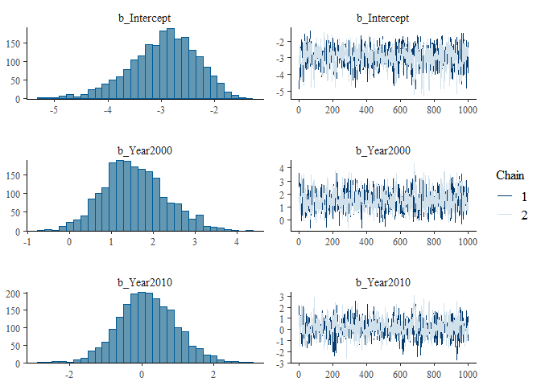<!-- -->

``` r
plot(fit_african_american)
```

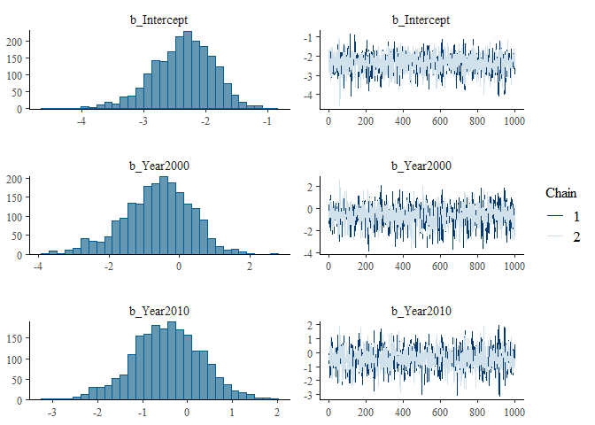<!-- -->

``` r
plot(fit_fear)
```

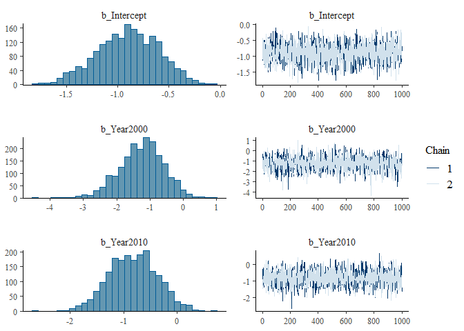<!-- -->

``` r
plot(fit_hist)
```

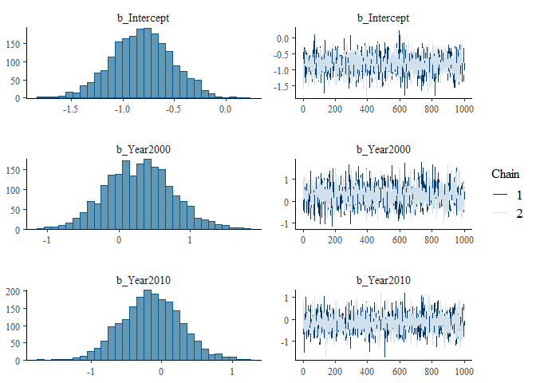<!-- -->

``` r
plot(fit_lgbtq)
```

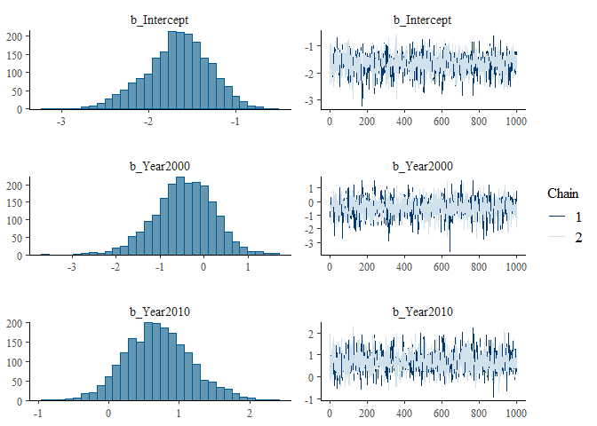<!-- -->

``` r
plot(fit_mental_health)
```

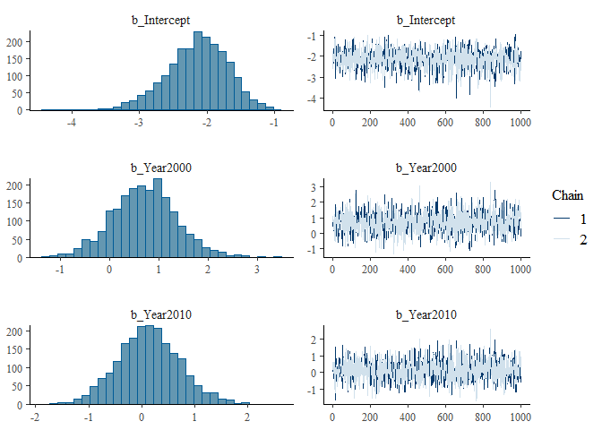<!-- -->

``` r
plot(fit_sexual_content)
```

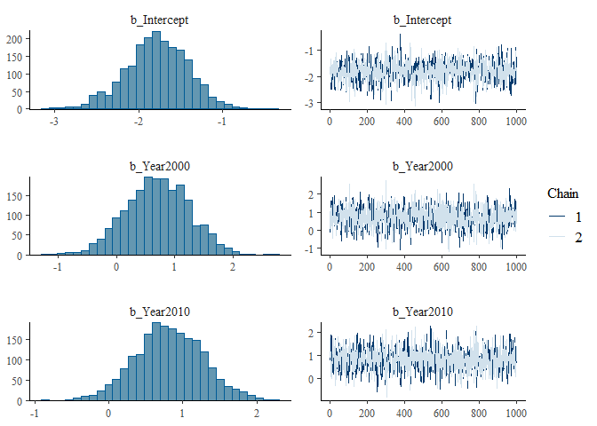<!-- -->

``` r
#doing hypothesis tests to investigate the effect between 2000 and 2010, as our models only compare 2000 and 2010 to 1990 and not to each other

hypothesis(fit_conflict, "Intercept + Year2000 = Intercept + Year2010")
```

    ## Hypothesis Tests for class b:
    ##                 Hypothesis Estimate Est.Error CI.Lower CI.Upper Evid.Ratio
    ## 1 (Intercept+Year20... = 0     1.38      0.68     0.06     2.76         NA
    ##   Post.Prob Star
    ## 1        NA    *
    ## ---
    ## 'CI': 90%-CI for one-sided and 95%-CI for two-sided hypotheses.
    ## '*': For one-sided hypotheses, the posterior probability exceeds 95%;
    ## for two-sided hypotheses, the value tested against lies outside the 95%-CI.
    ## Posterior probabilities of point hypotheses assume equal prior probabilities.

``` r
hypothesis(fit_lgbtq, "Intercept + Year2000 = Intercept + Year2010")
```

    ## Hypothesis Tests for class b:
    ##                 Hypothesis Estimate Est.Error CI.Lower CI.Upper Evid.Ratio
    ## 1 (Intercept+Year20... = 0    -1.15      0.62    -2.46    -0.06         NA
    ##   Post.Prob Star
    ## 1        NA    *
    ## ---
    ## 'CI': 90%-CI for one-sided and 95%-CI for two-sided hypotheses.
    ## '*': For one-sided hypotheses, the posterior probability exceeds 95%;
    ## for two-sided hypotheses, the value tested against lies outside the 95%-CI.
    ## Posterior probabilities of point hypotheses assume equal prior probabilities.

``` r
hypothesis(fit_african_american, "Intercept + Year2000 = Intercept + Year2010")
```

    ## Hypothesis Tests for class b:
    ##                 Hypothesis Estimate Est.Error CI.Lower CI.Upper Evid.Ratio
    ## 1 (Intercept+Year20... = 0    -0.18         1    -2.29     1.72         NA
    ##   Post.Prob Star
    ## 1        NA     
    ## ---
    ## 'CI': 90%-CI for one-sided and 95%-CI for two-sided hypotheses.
    ## '*': For one-sided hypotheses, the posterior probability exceeds 95%;
    ## for two-sided hypotheses, the value tested against lies outside the 95%-CI.
    ## Posterior probabilities of point hypotheses assume equal prior probabilities.

``` r
hypothesis(fit_fear, "Intercept + Year2000 = Intercept + Year2010")
```

    ## Hypothesis Tests for class b:
    ##                 Hypothesis Estimate Est.Error CI.Lower CI.Upper Evid.Ratio
    ## 1 (Intercept+Year20... = 0    -0.43      0.67    -1.82     0.81         NA
    ##   Post.Prob Star
    ## 1        NA     
    ## ---
    ## 'CI': 90%-CI for one-sided and 95%-CI for two-sided hypotheses.
    ## '*': For one-sided hypotheses, the posterior probability exceeds 95%;
    ## for two-sided hypotheses, the value tested against lies outside the 95%-CI.
    ## Posterior probabilities of point hypotheses assume equal prior probabilities.

``` r
hypothesis(fit_hist, "Intercept + Year2000 = Intercept + Year2010")
```

    ## Hypothesis Tests for class b:
    ##                 Hypothesis Estimate Est.Error CI.Lower CI.Upper Evid.Ratio
    ## 1 (Intercept+Year20... = 0     0.44      0.45    -0.48     1.35         NA
    ##   Post.Prob Star
    ## 1        NA     
    ## ---
    ## 'CI': 90%-CI for one-sided and 95%-CI for two-sided hypotheses.
    ## '*': For one-sided hypotheses, the posterior probability exceeds 95%;
    ## for two-sided hypotheses, the value tested against lies outside the 95%-CI.
    ## Posterior probabilities of point hypotheses assume equal prior probabilities.

``` r
hypothesis(fit_mental_health, "Intercept + Year2000 = Intercept + Year2010")
```

    ## Hypothesis Tests for class b:
    ##                 Hypothesis Estimate Est.Error CI.Lower CI.Upper Evid.Ratio
    ## 1 (Intercept+Year20... = 0     0.57      0.58    -0.62     1.66         NA
    ##   Post.Prob Star
    ## 1        NA     
    ## ---
    ## 'CI': 90%-CI for one-sided and 95%-CI for two-sided hypotheses.
    ## '*': For one-sided hypotheses, the posterior probability exceeds 95%;
    ## for two-sided hypotheses, the value tested against lies outside the 95%-CI.
    ## Posterior probabilities of point hypotheses assume equal prior probabilities.

``` r
hypothesis(fit_sexual_content, "Intercept + Year2000 = Intercept + Year2010")
```

    ## Hypothesis Tests for class b:
    ##                 Hypothesis Estimate Est.Error CI.Lower CI.Upper Evid.Ratio
    ## 1 (Intercept+Year20... = 0    -0.12       0.5    -1.11     0.84         NA
    ##   Post.Prob Star
    ## 1        NA     
    ## ---
    ## 'CI': 90%-CI for one-sided and 95%-CI for two-sided hypotheses.
    ## '*': For one-sided hypotheses, the posterior probability exceeds 95%;
    ## for two-sided hypotheses, the value tested against lies outside the 95%-CI.
    ## Posterior probabilities of point hypotheses assume equal prior probabilities.

``` r
#plotting them as well
plot(hypothesis(fit_conflict, "Intercept + Year2000 = Intercept + Year2010"))
```

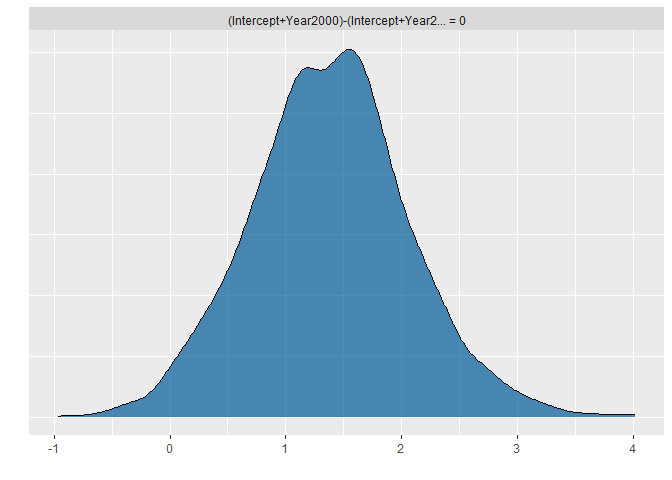<!-- -->

``` r
plot(hypothesis(fit_lgbtq, "Intercept + Year2000 = Intercept + Year2010"))
```

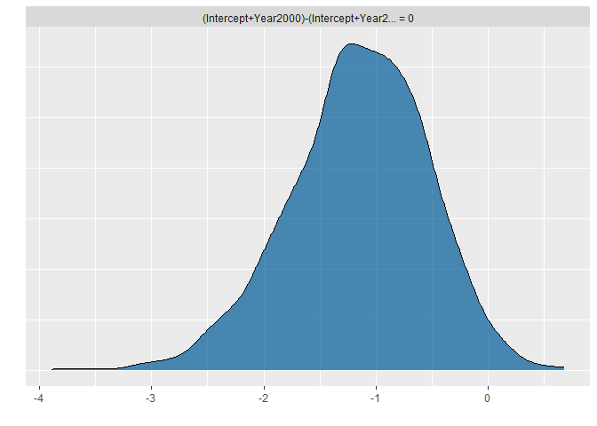<!-- -->

``` r
plot(hypothesis(fit_african_american, "Intercept + Year2000 = Intercept + Year2010"))
```

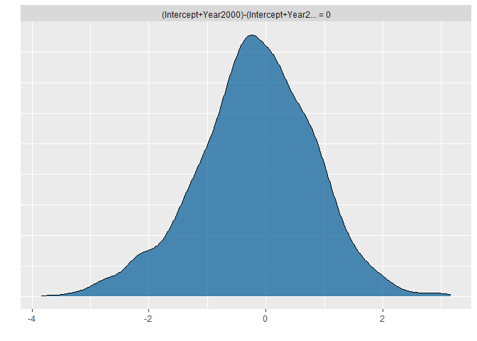<!-- -->

``` r
plot(hypothesis(fit_fear, "Intercept + Year2000 = Intercept + Year2010"))
```

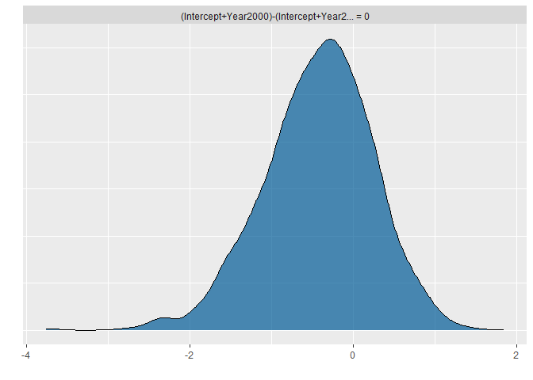<!-- -->

``` r
plot(hypothesis(fit_hist, "Intercept + Year2000 = Intercept + Year2010"))
```

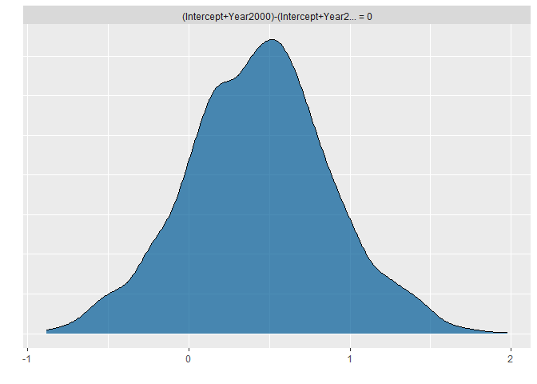<!-- -->

``` r
plot(hypothesis(fit_mental_health, "Intercept + Year2000 = Intercept + Year2010"))
```

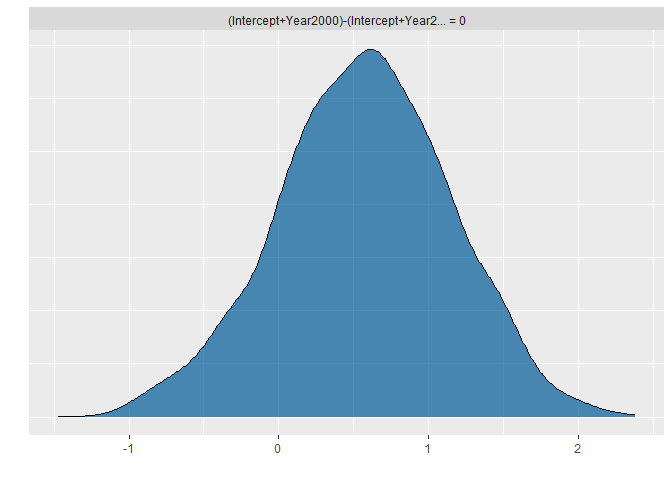<!-- -->

``` r
plot(hypothesis(fit_sexual_content, "Intercept + Year2000 = Intercept + Year2010"))
```

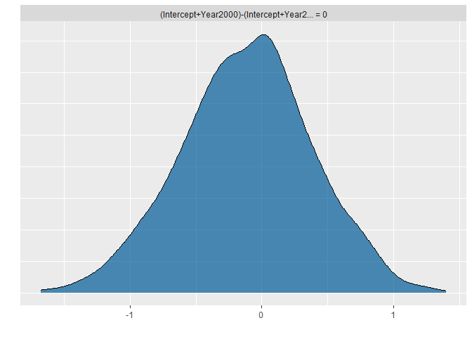<!-- -->
