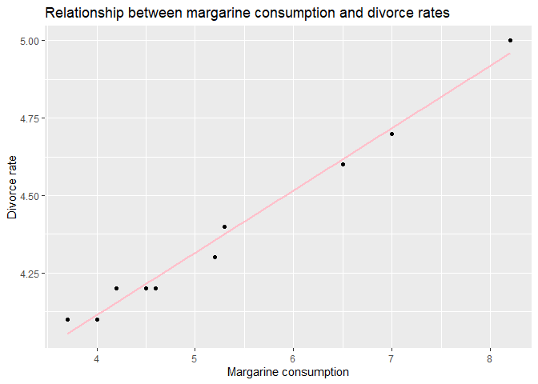
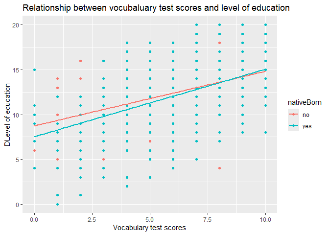
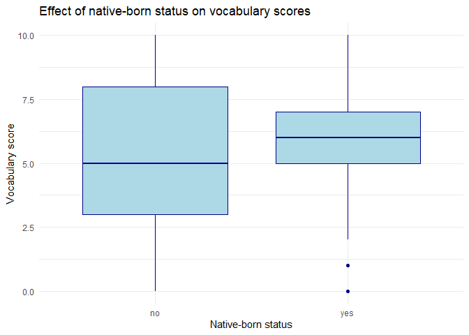
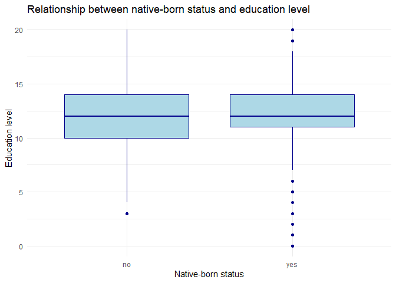
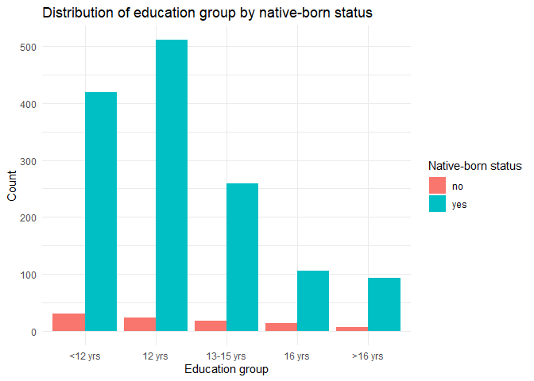

cultural_intro_a2
================
Laura Lundbye
2024-11-10

``` r
install.packages('dslabs')
```

    ## Installing package into 'C:/Users/laura/AppData/Local/R/win-library/4.3'
    ## (as 'lib' is unspecified)

    ## package 'dslabs' successfully unpacked and MD5 sums checked
    ## 
    ## The downloaded binary packages are in
    ##  C:\Users\laura\AppData\Local\Temp\RtmpC641Ec\downloaded_packages

``` r
install.packages('car')
```

    ## Installing package into 'C:/Users/laura/AppData/Local/R/win-library/4.3'
    ## (as 'lib' is unspecified)

    ## package 'car' successfully unpacked and MD5 sums checked
    ## 
    ## The downloaded binary packages are in
    ##  C:\Users\laura\AppData\Local\Temp\RtmpC641Ec\downloaded_packages

``` r
library(dplyr)
```

    ## 
    ## Attaching package: 'dplyr'

    ## The following objects are masked from 'package:stats':
    ## 
    ##     filter, lag

    ## The following objects are masked from 'package:base':
    ## 
    ##     intersect, setdiff, setequal, union

``` r
library(ggplot2)
library(dslabs)
library(car)
```

    ## Loading required package: carData

    ## 
    ## Attaching package: 'car'

    ## The following object is masked from 'package:dplyr':
    ## 
    ##     recode

## 1) Load the ‘divorce_margarine’dataset from the ’dslabs’ package. Investigate the correlation between margarine consumption and divorce rates in Maine. Would an increase in the preference for margarine lead to skyrocketing divorce rate?

``` r
data(package = "dslabs")
data("divorce_margarine")
divorce_margarine
```

    ##    divorce_rate_maine margarine_consumption_per_capita year
    ## 1                 5.0                              8.2 2000
    ## 2                 4.7                              7.0 2001
    ## 3                 4.6                              6.5 2002
    ## 4                 4.4                              5.3 2003
    ## 5                 4.3                              5.2 2004
    ## 6                 4.1                              4.0 2005
    ## 7                 4.2                              4.6 2006
    ## 8                 4.2                              4.5 2007
    ## 9                 4.2                              4.2 2008
    ## 10                4.1                              3.7 2009

visually assessing correlation between predictor and outcome

``` r
ggplot(divorce_margarine, aes(x = margarine_consumption_per_capita, y = divorce_rate_maine)) +
  geom_point() +
  geom_smooth(method = "lm", se = FALSE, color = "pink") +
  labs(title = "Relationship between margarine consumption and divorce rates",
       x = "Margarine consumption",
       y = "Divorce rate")
```

    ## `geom_smooth()` using formula = 'y ~ x'

<!-- -->

fitting a linear model to further investigate correlation between
predictor and outcome variable

``` r
# Fit a linear model
cor_model <- lm(divorce_rate_maine ~ margarine_consumption_per_capita, data = divorce_margarine)
summary(cor_model)
```

    ## 
    ## Call:
    ## lm(formula = divorce_rate_maine ~ margarine_consumption_per_capita, 
    ##     data = divorce_margarine)
    ## 
    ## Residuals:
    ##      Min       1Q   Median       3Q      Max 
    ## -0.05583 -0.01816 -0.01452  0.03601  0.04625 
    ## 
    ## Coefficients:
    ##                                  Estimate Std. Error t value Pr(>|t|)    
    ## (Intercept)                      3.308626   0.048032   68.88 2.20e-12 ***
    ## margarine_consumption_per_capita 0.201386   0.008735   23.05 1.33e-08 ***
    ## ---
    ## Signif. codes:  0 '***' 0.001 '**' 0.01 '*' 0.05 '.' 0.1 ' ' 1
    ## 
    ## Residual standard error: 0.03841 on 8 degrees of freedom
    ## Multiple R-squared:  0.9852, Adjusted R-squared:  0.9833 
    ## F-statistic: 531.5 on 1 and 8 DF,  p-value: 1.33e-08

the expected divorce rate in maine when margarine consumption is zero is
3.3 (intercept). when margarine consumption increases with one unit, the
divorce rate increases with 0.2 (slope). in other words, there is a
positive correlation between the two. the p-value (1.33e-08) for our
coefficient is extremely small, indicating significant effect. a high
adjusted R-squared value of 0.98 means that (according to this model)
aprox 98% of the variation in the divorce rate data can be explained by
margarine consumption.

this exercise is a demonstration of how correlation doesn’t imply
causation. the drop in divorce rate as well as margarine consumption
from 2000 to 2009 are most likely unrelated, in the sense that one isn’t
causing the other. this kind of relationship is called a spurious
correlation. therefore, we cannot safely assume that a sudden increase
in margarine consumption would cause an increase in divorce rate as
well.

## 2) Load the ‘GSSvocab’ dataset from the ‘car’ package. This dataset contains people’s scores on an English vocabulary test and includes demographic information

### Filter for the year 1978 and remove rows with missing values

``` r
GSSvocab_1978 <- GSSvocab %>%
  filter(year == 1978) %>%    # Filter for rows where year is 1978
  na.omit() 
```

### Is a person’s score on the vocabulary test (‘vocab’) significantly impacted by their level of education (‘educ’)? Visualize the relationship in a plot and build a model. Briefly explain the results

``` r
ggplot(GSSvocab_1978, aes(x = vocab, y = educ, color = nativeBorn)) +
  geom_point() +
  geom_smooth(method = "lm", se = FALSE) +
  labs(title = "Relationship between vocubaluary test scores and level of education",
       x = "Vocabulary test scores",
       y = "DLevel of education")
```

    ## `geom_smooth()` using formula = 'y ~ x'

<!-- -->
fitting a model as well

``` r
vocab_model1 <- lm(vocab ~ educ, data = GSSvocab_1978)
summary(vocab_model1)
```

    ## 
    ## Call:
    ## lm(formula = vocab ~ educ, data = GSSvocab_1978)
    ## 
    ## Residuals:
    ##     Min      1Q  Median      3Q     Max 
    ## -7.1233 -1.1608  0.0542  1.0917  5.6243 
    ## 
    ## Coefficients:
    ##             Estimate Std. Error t value Pr(>|t|)    
    ## (Intercept)  1.23567    0.19957   6.192  7.7e-10 ***
    ## educ         0.39251    0.01606  24.443  < 2e-16 ***
    ## ---
    ## Signif. codes:  0 '***' 0.001 '**' 0.01 '*' 0.05 '.' 0.1 ' ' 1
    ## 
    ## Residual standard error: 1.885 on 1475 degrees of freedom
    ## Multiple R-squared:  0.2883, Adjusted R-squared:  0.2878 
    ## F-statistic: 597.5 on 1 and 1475 DF,  p-value: < 2.2e-16

when education level increases with one unit, the vocabulary test score
increases with 0.39 (slope), meaning there is a positive correlation
between the two. the very small p-value (\< 2e-16) for our coefficient
indicates significant effect. an adjusted r-squared value of 0.28 means
that this model can only account for aprox 28% of the variation in the
vocabulary test score data. in conclusion, education level has a
significant positive effect on vocabulary test scores.

### Whether a person is the native of an English-speaking country (‘nativeBorn’) could potentially have an impact on the size of their vocabulary. Visualize the relationship and add the predictor to the model. Briefly explain the results.

``` r
ggplot(GSSvocab_1978, aes(x = nativeBorn, y = vocab)) +
  geom_boxplot(fill = "lightblue", color = "darkblue") +
  labs(title = "Effect of native-born status on vocabulary scores",
       x = "Native-born status",
       y = "Vocabulary score") +
  theme_minimal()
```

<!-- -->

``` r
vocab_model2 <- lm(vocab ~ educ + nativeBorn, data = GSSvocab_1978)
summary(vocab_model2)
```

    ## 
    ## Call:
    ## lm(formula = vocab ~ educ + nativeBorn, data = GSSvocab_1978)
    ## 
    ## Residuals:
    ##    Min     1Q Median     3Q    Max 
    ## -7.162 -1.200  0.015  1.231  5.803 
    ## 
    ## Coefficients:
    ##               Estimate Std. Error t value Pr(>|t|)    
    ## (Intercept)    0.62803    0.27651   2.271  0.02327 *  
    ## educ           0.39222    0.01601  24.499  < 2e-16 ***
    ## nativeBornyes  0.65032    0.20551   3.164  0.00159 ** 
    ## ---
    ## Signif. codes:  0 '***' 0.001 '**' 0.01 '*' 0.05 '.' 0.1 ' ' 1
    ## 
    ## Residual standard error: 1.879 on 1474 degrees of freedom
    ## Multiple R-squared:  0.2931, Adjusted R-squared:  0.2921 
    ## F-statistic: 305.6 on 2 and 1474 DF,  p-value: < 2.2e-16

the model shows a significant positive effect of being native on
vocabulary test scores.

### Does a person’s level of education depend on whether they are a native of the country? Visualize the relationship. Do you think it makes sense to add the relationship as an interaction term? Try creating the model and briefly explain the results

``` r
ggplot(GSSvocab_1978, aes(x = nativeBorn, y = educ)) +
  geom_boxplot(fill = "lightblue", color = "darkblue") +
  labs(title = "Relationship between native-born status and education level",
       x = "Native-born status",
       y = "Education level") +
  theme_minimal()
```

<!-- -->
i’m also interested in the count of people with various years of
education here i use the variable educGroup, as i want better
readability (i dont want a bar for every year)

``` r
# Bar plot to show the distribution of education levels by native-born status
ggplot(GSSvocab_1978, aes(x = educGroup, fill = nativeBorn)) +
  geom_bar(position = "dodge") +
  labs(title = "Distribution of education group by native-born status",
       x = "Education group",
       y = "Count",
       fill = "Native-born status") +
  theme_minimal()
```

<!-- -->
in the boxplot, we see that the average educational level is aprox the
same for both groups.

the barplot lends more nuance to this. for natives, 12 years of
education is the most common. there is a sizeable drop in number in the
13-15 years group, and only a small difference in number between the 16
years and 16+ years groups. for non-natives, there is a rather steady
decrease in number chronologically.

importantly, the sample size of the non-natives group is vastly smaller
than that of the natives group.

``` r
vocab_model3 <- lm(vocab ~ educ * nativeBorn, data = GSSvocab_1978)
summary(vocab_model3)
```

    ## 
    ## Call:
    ## lm(formula = vocab ~ educ * nativeBorn, data = GSSvocab_1978)
    ## 
    ## Residuals:
    ##     Min      1Q  Median      3Q     Max 
    ## -7.1554 -1.2049  0.0149  1.2347  5.9857 
    ## 
    ## Coefficients:
    ##                    Estimate Std. Error t value Pr(>|t|)    
    ## (Intercept)         0.35394    0.68780   0.515    0.607    
    ## educ                0.41510    0.05496   7.553 7.45e-14 ***
    ## nativeBornyes       0.95000    0.71855   1.322    0.186    
    ## educ:nativeBornyes -0.02501    0.05745  -0.435    0.663    
    ## ---
    ## Signif. codes:  0 '***' 0.001 '**' 0.01 '*' 0.05 '.' 0.1 ' ' 1
    ## 
    ## Residual standard error: 1.88 on 1473 degrees of freedom
    ## Multiple R-squared:  0.2932, Adjusted R-squared:  0.2917 
    ## F-statistic: 203.7 on 3 and 1473 DF,  p-value: < 2.2e-16

there’s no significant interaction effect and there’s no significant
main effect of being native born when the interaction is included. the
lack of significance may be due to the small sample size of non-natives
mentioned earlier.

### Which model performs best?

``` r
anova(vocab_model1, vocab_model2, vocab_model3)
```

    ## Analysis of Variance Table
    ## 
    ## Model 1: vocab ~ educ
    ## Model 2: vocab ~ educ + nativeBorn
    ## Model 3: vocab ~ educ * nativeBorn
    ##   Res.Df    RSS Df Sum of Sq       F  Pr(>F)   
    ## 1   1475 5241.8                                
    ## 2   1474 5206.5  1    35.371 10.0083 0.00159 **
    ## 3   1473 5205.8  1     0.670  0.1894 0.66344   
    ## ---
    ## Signif. codes:  0 '***' 0.001 '**' 0.01 '*' 0.05 '.' 0.1 ' ' 1

the second model performs better than the first model. there is no
significant difference between the second and third model. since the
third model is more complex because of the interaction effect, but
doesn’t perform better, we prefer the second model.
